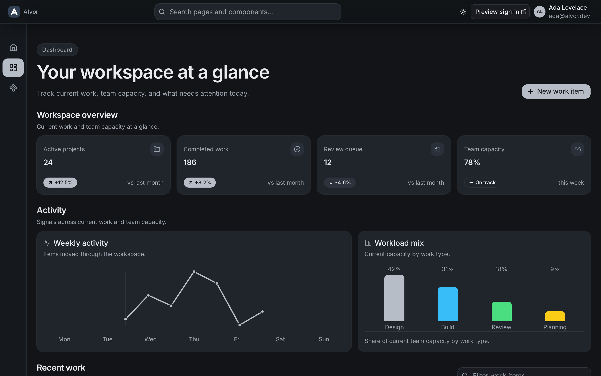
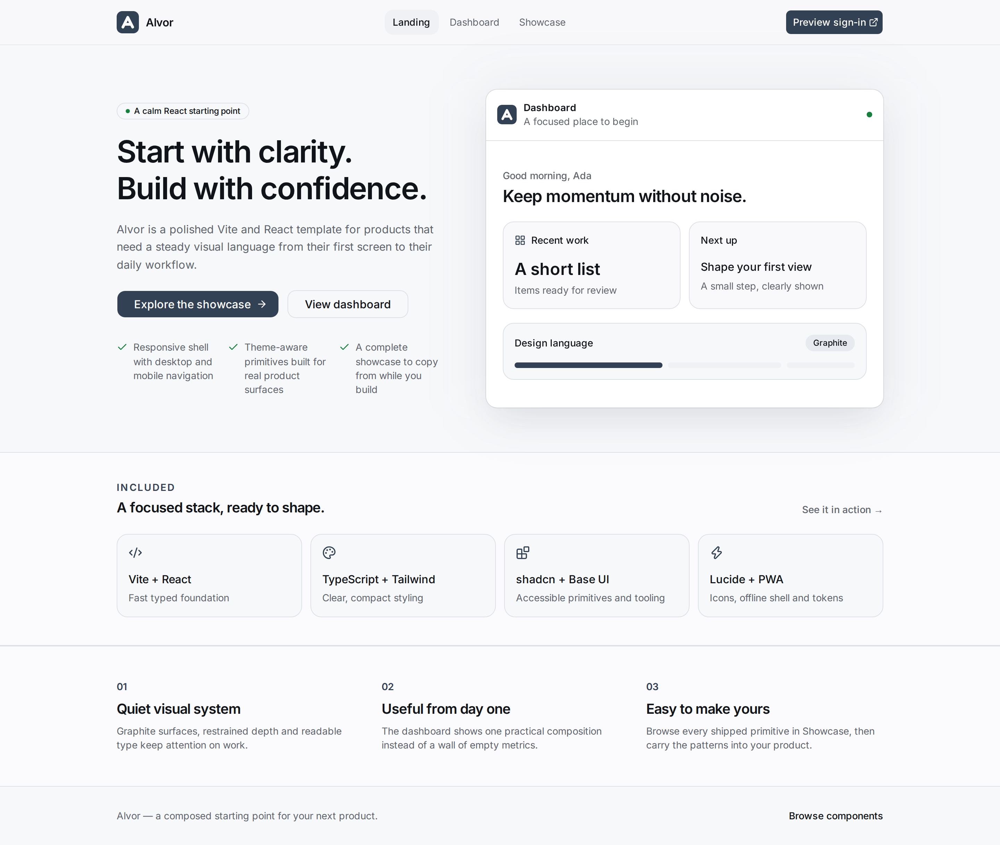
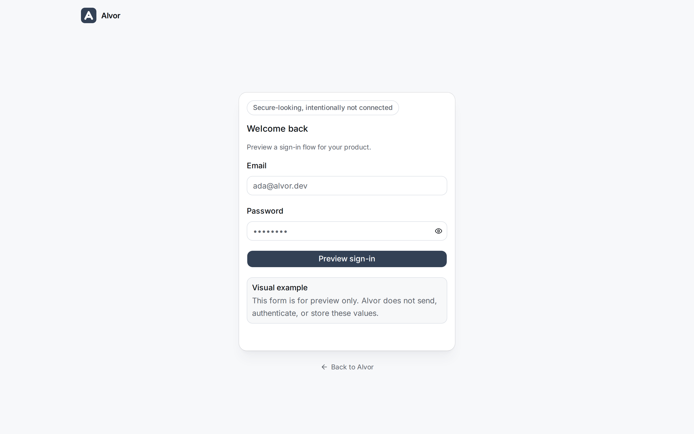
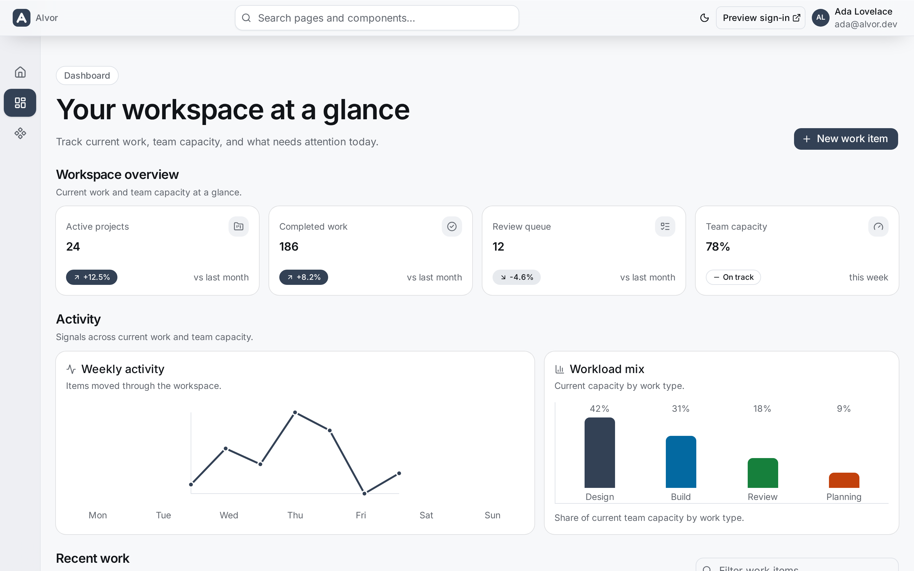
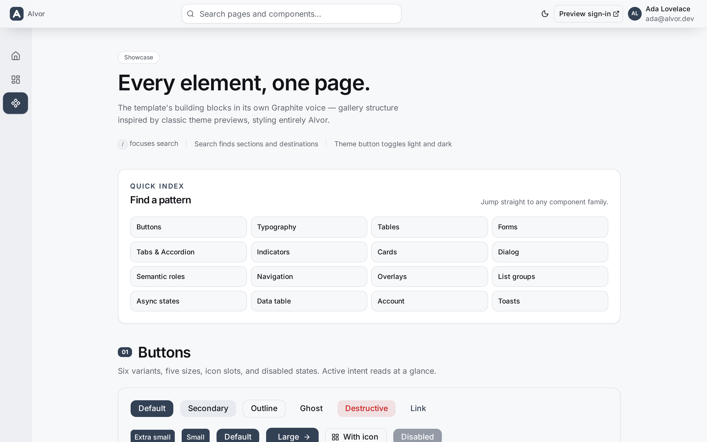

<div align="center">


# Alvor

A calm operational dashboard template.

**Vite · React 19 · TypeScript · Tailwind CSS v4 · shadcn Base UI (Nova) · Lucide**

[Quick start](#quick-start) · [Screenshots](#screenshots) · [Design tokens](#design-tokens) · [Conventions](#conventions)



</div>

---

## About

Alvor is a calm operational dashboard you can shape into a real product. It ships with:

- A concise **landing page** at `/` — standalone, no application shell.
- A **dashboard** at `/dashboard` — metric cards, inline charts, and a work-items table with filter, sort, and pagination backed by non-sensitive URL parameters. All data is local starter data; nothing is authenticated or sent anywhere.
- A **component showcase** at `/showcase` — every shipped UI primitive with stable anchors and header-search indexing. Copy from it while you build.
- A standalone **visual sign-in example** at `/login` — opened in a new tab; it never sends, authenticates, or stores form values.
- An **adaptive application shell** — a compact desktop rail that expands on hover or keyboard focus, with bottom tabs on mobile and URL-derived active state.
- **Real URL routing** with lazy, per-route pages (landing, sign-in, dashboard, showcase).
- **Light/dark/system themes** with flash-free initial paint and live OS-preference tracking.
- **PWA shell** with a user-confirmed update prompt that preserves active form work.
- **Design tokens** generated from `DESIGN.md` and guarded against drift.

## Screenshots

| Landing | Sign-in example |
| :---: | :---: |
|  |  |

| Dashboard — light | Dashboard — dark |
| :---: | :---: |
|  |  |

| Component showcase |
| :---: |
|  |

## Quick start

**Requirements:** Node `^20.19.0 || >=22.12.0`, npm 11. Python 3 + Pillow only to regenerate PWA icons (`npm run icons`).

```sh
npm install
npm run dev
```

Then open the routes below in an evergreen browser.

## Scripts

| Script | What it does |
|---|---|
| `npm run dev` | Dev server |
| `npm run build` | Type-check + production build |
| `npm run preview` | Preview production build |
| `npm run lint` | Oxlint with warnings denied |
| `npm run design:lint` | Validate `DESIGN.md` |
| `npm run design:export` | Regenerate `src/design-theme.css` from `DESIGN.md` |
| `npm run design:check` | Fail if `src/design-theme.css` drifts from `DESIGN.md` |
| `npm run icons` | Regenerate PWA icons from the SVG "A" mark (needs Pillow) |

## Routes

`src/App.tsx` declares routes with `react-router`; `src/components/layout/nav-items.ts` is the canonical application nav (Landing → `/`, Dashboard → `/dashboard`, Showcase → `/showcase`). `SiteShell` derives active state from the URL and preserves useful scroll context across history navigation. Application pages load independently, so the landing, sign-in, dashboard, and showcase surfaces stay lazy.

| Route | Surface | Role |
|---|---|---|
| `/` | Standalone | Public landing content; intentionally no application shell |
| `/login` | Standalone | Visual sign-in form opened in a new tab; not authentication |
| `/dashboard` | `SiteShell` | Primary public dashboard; local starter data, URL-backed table controls |
| `/showcase` | `SiteShell` | Complete developer reference for shipped UI primitives |
| `/me` | Redirect | Compatibility redirect to `/dashboard` |

Sign in stays a separate action so the public access flow does not become a destination inside the application shell.

### Adding a page

1. Add the item with its `path` in `nav-items.ts` when it belongs in application navigation.
2. Add a lazy route in `App.tsx` and a title in `TITLES`.
3. Add a stable entry to `src/pages/showcase/section-registry.ts` when the page exposes showcase patterns.
4. Replace `PlaceholderPage` with the real surface when ready.

### Removing the showcase

Delete `src/pages/showcase/`, remove its route and navigation entry, and replace links to `/showcase`. The landing and dashboard pages remain independent.

## Design tokens

`DESIGN.md` is the source of truth for light-scheme primitives:

```text
DESIGN.md → npm run design:export → src/design-theme.css (checked-in contract)
```

`src/design-theme.css` is intentionally not imported at runtime: its `--spacing-*` keys hijack `max-w-*` utilities and its values form cyclic variables with the aliases below. `src/index.css` holds literal primitives mirroring `DESIGN.md`, maps them onto runtime variables (`--paper`, `--brand`, …), and owns the `.dark` overrides plus the Tailwind `@theme inline` aliases.

Run `npm run design:check` after token edits; it checks generated-file drift and runtime mappings, and any `DESIGN.md` change must be mirrored into `src/index.css` by hand.

## PWA

The service worker uses a user-confirmed update prompt. The app toasts when offline-ready and keeps an update notification visible until the user reloads or dismisses it. Caches are cleaned on activate. Manifest, `start_url`, and `scope` assume the app is served from `/`; for a subpath deployment, set Vite `base` and mirror it in `vite.config.ts` PWA paths.

To clear dev caches: DevTools → Application → Storage → Clear site data.

## Conventions

- Imports use the `@/*` alias. `cn` comes from `@/lib/utils` in project code; generated `src/components/ui/*` files import `cn` directly to stay close to upstream shadcn.
- `strict` + `noUncheckedIndexedAccess` are on.
- No automated test runner or CI is configured (deliberate). Verify with `npm run lint` (warnings denied), `npm run design:lint`, `npm run design:check`, and `npm run build`. Manually inspect direct routes, new-tab sign-in isolation, themes, responsive layouts, keyboard focus, reduced motion, history restoration, and showcase anchors/search.

## Browser support

Evergreen browsers with `backdrop-filter`, `color-mix`, and `oklch`. Reduced-motion preferences are respected; animations are fade/small-slide only.

## Project docs

- [`CONTEXT.md`](CONTEXT.md) — project map and durable decisions
- [`CONVENTIONS.md`](CONVENTIONS.md) — engineering rules
- [`DESIGN.md`](DESIGN.md) — design tokens and rationale

---

Screenshots live in `docs/img/` and were captured from `npm run dev` at 1440×900. Regenerate them when the UI changes.
